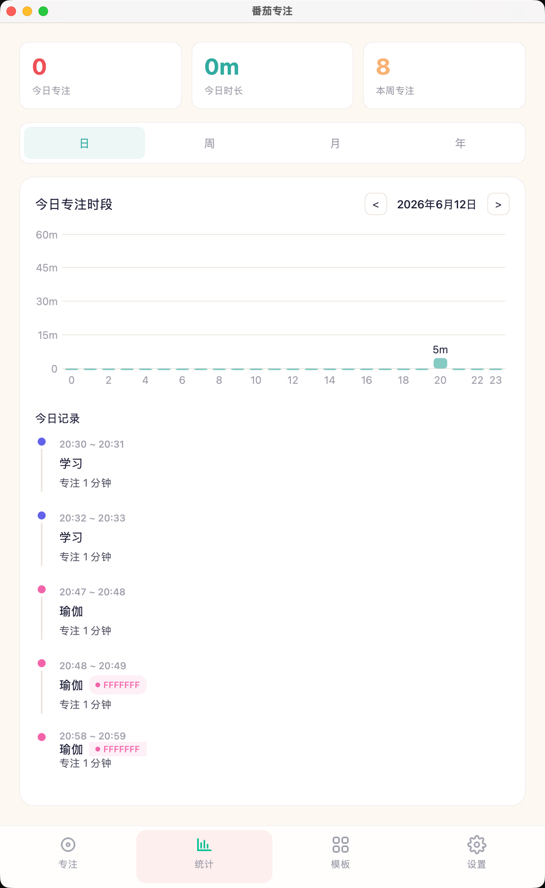
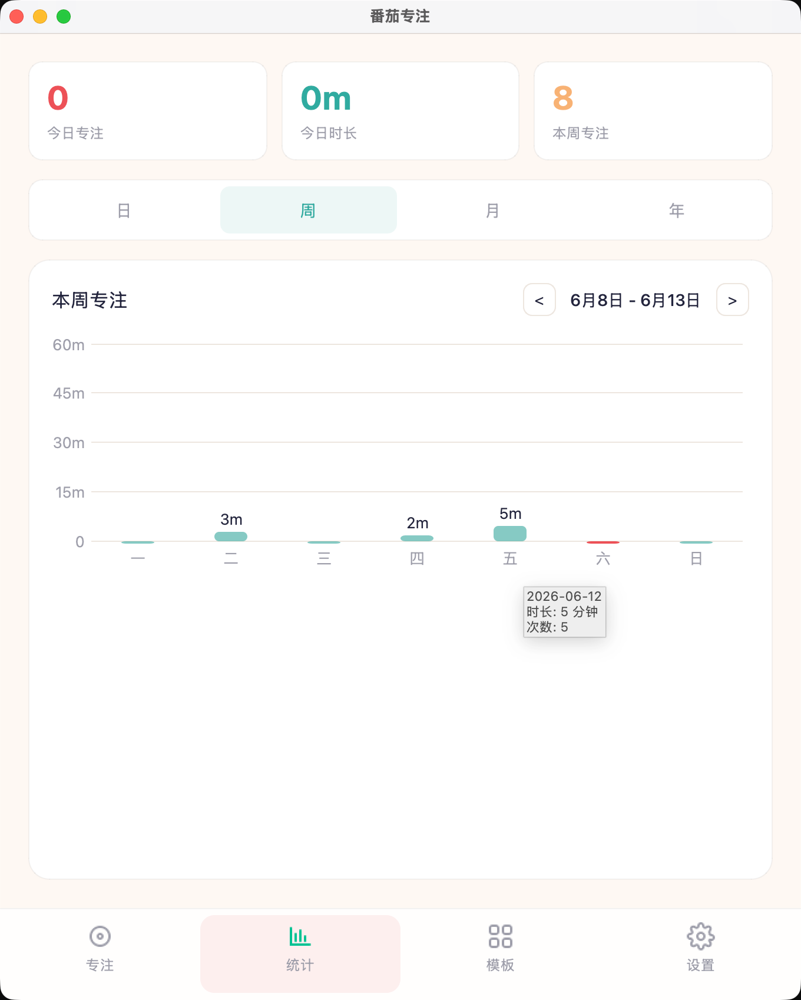
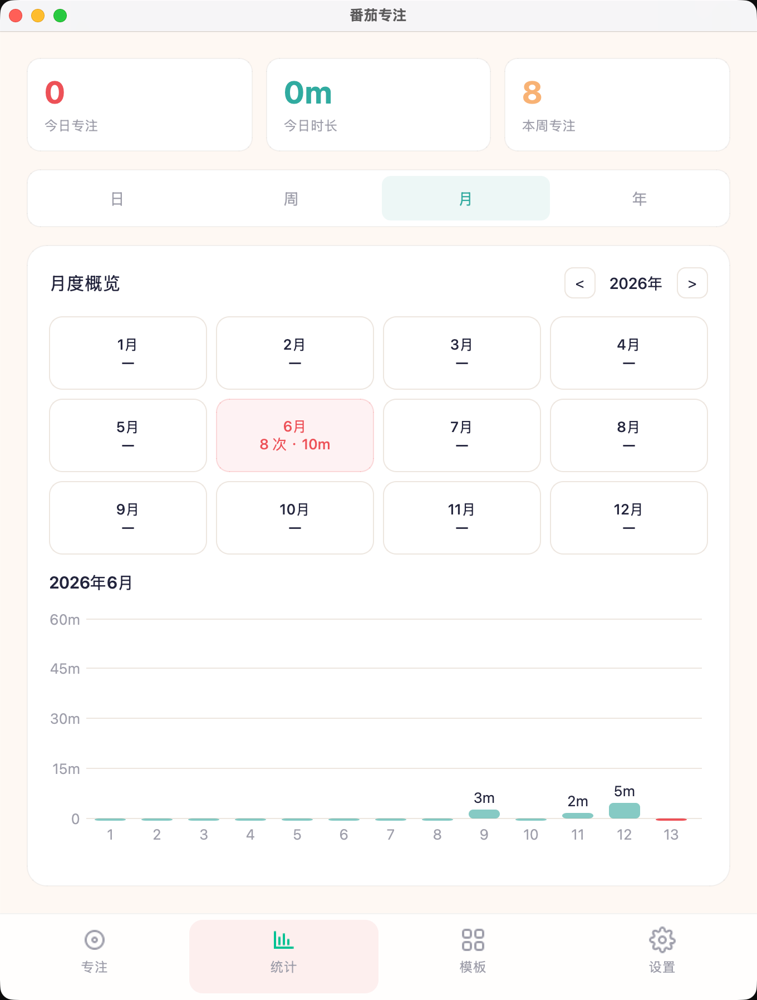
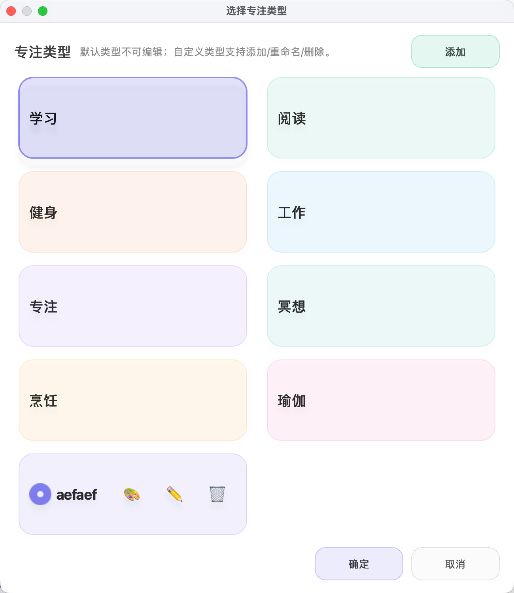

# 番茄专注

<p align="center">
  
</p>

<p align="center">
  <a href="https://github.com/SublimeCT/tomato-clock-pyqt6/releases">
    
  </a>
  <a href="https://github.com/SublimeCT/tomato-clock-pyqt6/actions/workflows/release.yml">
    
  </a>
  
  
  
</p>

| 页面 | 截图 | 说明 |
|--- |--- |--- |
| 专注 | `MacOS`:  `Ubuntu`:  `Windows`:  | |
| 统计(日) |  | |
| 统计(周) |  | |
| 统计(月) |  | |
| 统计(年) |  | |
| 模板 |  | |
| 设置 |  | |
| 管理专注类型 |  | |
| 状态栏(MacOS 倒计时) |  | |

## 安装
可从 [github release](https://github.com/SublimeCT/tomato-clock-pyqt6/releases) 页面下载对应的安装包进行安装, 或自行 [打包](#打包)

### Windows
下载 `TomatoClock-Setup-<version>-Windows.exe` 安装包, 运行后会安装到当前用户目录并创建开始菜单快捷方式

### MacOS
下载 `TomatoClock-<version>-macOS.dmg`, 挂载后将 `TomatoClock.app` 拖到 `Applications` 即可

### Linux
下载 `TomatoClock-<version>-Linux-<arch>.AppImage`, 赋予可执行权限后直接运行:

```bash
chmod +x TomatoClock-*.AppImage
./TomatoClock-*.AppImage
```

对于 `Ubuntu 22.04` 或更高版本, 若系统缺少 `FUSE` 或 Qt 运行库, 可能会遇到以下报错:

#### 缺少 qt 依赖库
```bash
 ~/Downloads/dist/TomatoClock/TomatoClock 

qt.qpa.plugin: From 6.5.0, xcb-cursor0 or libxcb-cursor0 is needed to load the Qt xcb platform plugin.
qt.qpa.plugin: Could not load the Qt platform plugin "xcb" in "" even though it was found.
This application failed to start because no Qt platform plugin could be initialized. Reinstalling the application may fix this problem.

Available platform plugins are: wayland-brcm, wayland-egl, wayland, xcb, vnc, eglfs, minimal, minimalegl, offscreen, vkkhrdisplay, linuxfb.

Aborted
```

直接更新并安装缺少的依赖, 例如此处是 `libxcb-cursor0`:
```bash
sudo apt-add-repository universe
sudo apt update
sudo apt install -y libxcb-cursor0
```


## 技术栈
- [pyqt6](https://www.riverbankcomputing.com/static/Docs/PyQt6/): `qt` 的 `python` 绑定库
- [uv](https://docs.astral.sh/uv): 现代化的包管理工具

## 贡献
### 开发环境

```bash
# 安装依赖
uv sync
uv pip install -e .

# 运行应用(或点击 `src/main.py` 的 `Run Python File` 按钮)
uv run src/main.py
```

### QT Resource System
静态资源文件必须使用 [Qt Resource System](https://doc.qt.io/qt-6/zh/resources.html) 管理, 当资源文件更新时:

1. 将静态资源文件(图片 / 视频) 放到 `src/assets` 目录下
2. 打开 `resources.qrc` 文件, 添加资源文件
3. 运行 `rcc -g python resources.qrc -o src/assets/reources_rc.py` 生成 `src/assets/reources_rc.py` 文件
4. 在 `src/main.py` 中通过 `from src.assets import reources_rc` 引入(现在已经引入了)

`rcc` 命令来自 `qt` 工具链, 不包含在 `PyQt6` 包中

### 发布新版本
本项目基于 `Github Actions` 工作流, 只需提交 `tag` 即可自动打包

```bash
git tag v1.0.5
git push origin v1.0.5
```

### 打包

```bash
# 对于 MacOS:
chmod +x scripts/build_macos_release.sh
./scripts/build_macos_release.sh

# 对于 Windows:
pwsh ./scripts/build_windows_installer.ps1

# 对于 Linux:
chmod +x scripts/build_linux_appimage.sh
./scripts/build_linux_appimage.sh
```

```bash
# [MacOS] 调试 onedir .app
./dist/TomatoClock.app/Contents/MacOS/TomatoClock
```

正式发布产物:

- Windows: `TomatoClock-Setup-<version>-Windows.exe`
- macOS: `TomatoClock-<version>-macOS.dmg`
- Linux: `TomatoClock-<version>-Linux-<arch>.AppImage`

本项目使用 `Github Actions` 进行构建, 具体构建命令在 `.github/workflows/release.yml` 中

#### 制作应用图标
对于 `MacOS` 需要生成 `icon.iconset`:
```bash
mkdir icon.iconset

sips -z 16 16 src/assets/app-icon-256.png -o icon.iconset/icon_16x16.png
sips -z 32 32 src/assets/app-icon-256.png -o icon.iconset/icon_32x32.png
sips -z 128 128 src/assets/app-icon-256.png -o icon.iconset/icon_128x128.png
sips -z 256 256 src/assets/app-icon-256.png -o icon.iconset/icon_256x256.png
sips -z 512 512 src/assets/app-icon-512.png -o icon.iconset/icon_512x512.png

iconutil -c icns icon.iconset
```

对于 `Windows` 需要生成 `icon.ico`:
```bash
# uv add --dev pillow
uv run python -c "from PIL import Image; img = Image.open('src/assets/app-icon-512.
png'); img.save('icon.ico', format='ICO', sizes=[(16,16), (32,32), (48,48), (64,64), (128,128), (256,256)])"
```
