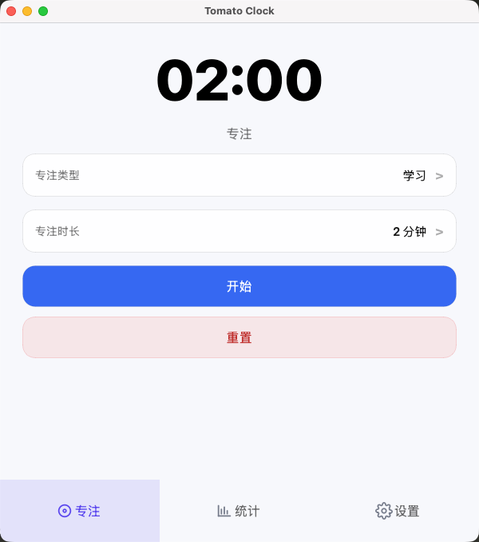
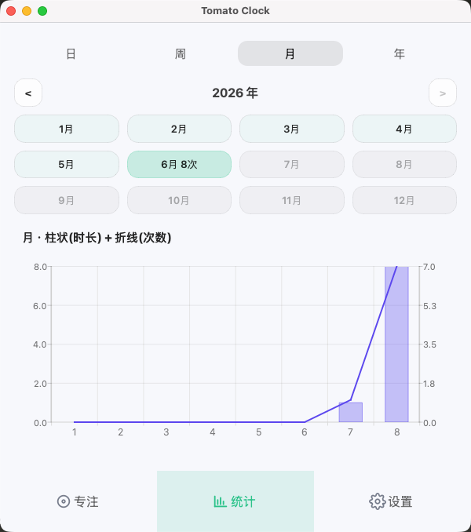
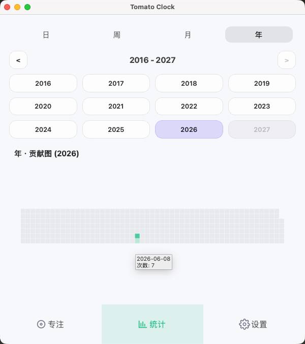
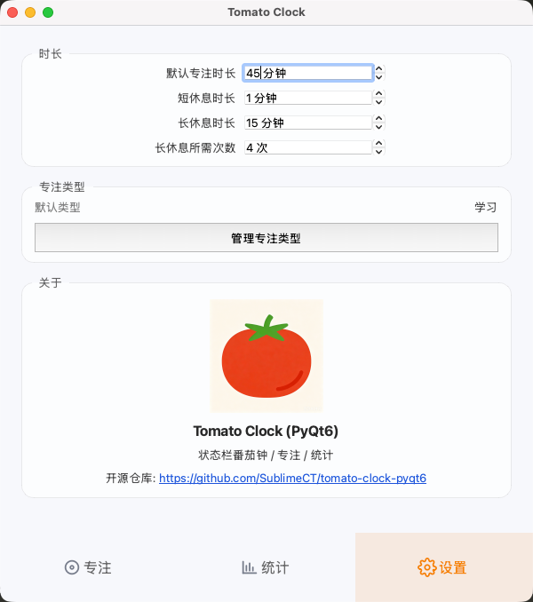
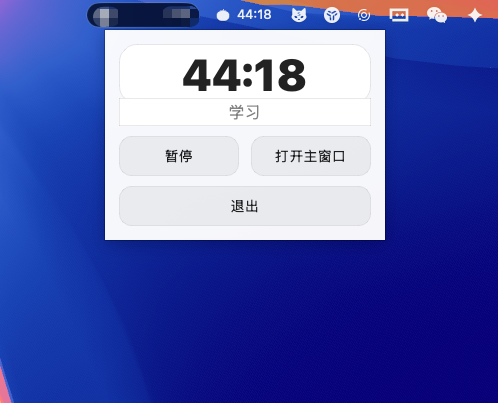

# 番茄专注

| 页面 | 截图 | 说明 |
|--- |--- |--- |
| 专注 |  | |
| 统计 |  | |
| 统计(年) |  | |
| 设置 |  | |
| 状态栏(MacOS 倒计时) |  | |


## 技术栈
- [pyqt6](https://www.riverbankcomputing.com/static/Docs/PyQt6/): `qt` 的 `python` 绑定库
- [uv](https://docs.astral.sh/uv): 现代化的包管理工具

## 贡献
### 开发环境

```bash
# 安装依赖
uv sync

# 运行应用
uv run src/main.py
```

### QT Resource System
静态资源文件必须使用 [Qt Resource System](https://doc.qt.io/qt-6/zh/resources.html) 管理, 当资源文件更新时:

1. 将静态资源文件(图片 / 视频) 放到 `src/assets` 目录下
2. 打开 `resources.qrc` 文件, 添加资源文件
3. 运行 `rcc -g python resources.qrc -o src/assets/reources_rc.py` 生成 `src/assets/reources_rc.py` 文件
4. 在 `src/main.py` 中通过 `from src.assets import reources_rc` 引入(现在已经引入了)

`rcc` 命令来自 `qt` 工具链, 不包含在 `PyQt6` 包中

### 打包

```bash
# 对于 MacOS:
uv run pyinstaller \
  --name TomatoClock \
  --windowed \
  --clean \
  --noconfirm \
  --icon icon.icns \
  src/main.py

# 对于 Windows:
uv run pyinstaller \
  --name TomatoClock \
  --windowed \
  --clean \
  --noconfirm \
  --icon icon.ico \
  src/main.py
```

```bash
# [MacOS] 打开应用, 或直接在 finder 中双击运行
./dist/TomatoClock.app/Contents/MacOS/TomatoClock
```

本项目使用 `Github Actions` 进行构建, 具体构建命令在 `github/workflows/release.yml` 中

#### 制作应用图标
对于 `MacOS` 需要生成 `icon.iconset`:
```bash
mkdir icon.iconset

sips -z 16 16 src/assets/app-icon-256.png -o icon.iconset/icon_16x16.png
sips -z 32 32 src/assets/app-icon-256.png -o icon.iconset/icon_32x32.png
sips -z 128 128 src/assets/app-icon-256.png -o icon.iconset/icon_128x128.png
sips -z 256 256 src/assets/app-icon-256.png -o icon.iconset/icon_256x256.png
sips -z 512 512 src/assets/app-icon-512.png -o icon.iconset/icon_512x512.png

iconutil -c icns icon.iconset
```

对于 `Windows` 需要生成 `icon.ico`:
```bash
# uv add --dev pillow
uv run python -c "from PIL import Image; img = Image.open('src/assets/app-icon-512.
png'); img.save('icon.ico', format='ICO', sizes=[(16,16), (32,32), (48,48), (64,64), (128,128), (256,256)])"
```